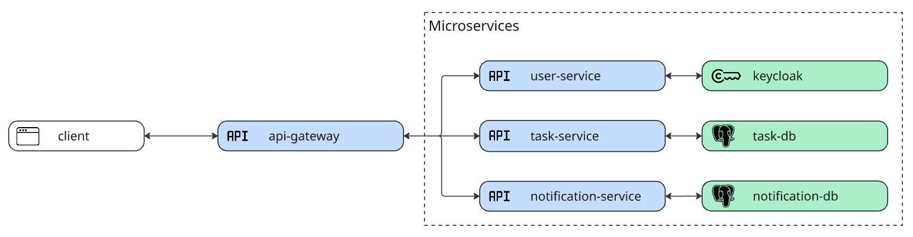
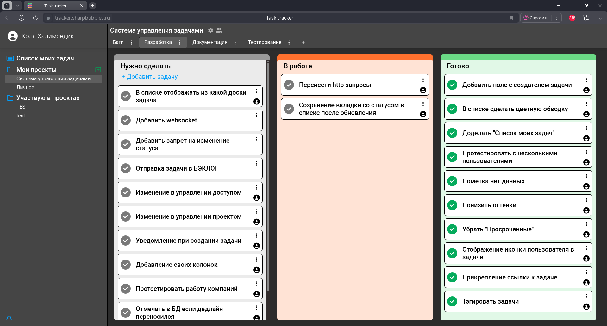

## Task tracker

Веб-приложение для управления проектами и задачами.

#### Версии

- [v0](https://github.com/NikKha03/task_tracker/tree/old_develop)
- [release/v1.0](https://github.com/NikKha03/task_tracker/tree/release/v1.0)
-   - hotfix/v1.1 (текущая)

#### Зависимости

task_service - hotfix/v1.1

user_service - release/v1.0

## Изменения с предыдущей версией

- Исправил баг со статусами задач в разделе "Список моих задач"
- Добавил секретный ключ, чтобы ограничить доступ к микросервисам напрямую, без использования api_gateway

## Стек технологий

**Frontend:** JS React

**Backend:** Java Spring Boot

**База данных:** PostgreSQL

Для **управление пользователями** интегрировал открытое решение **Keycloak**

## Архитектура

## Демонстрация

